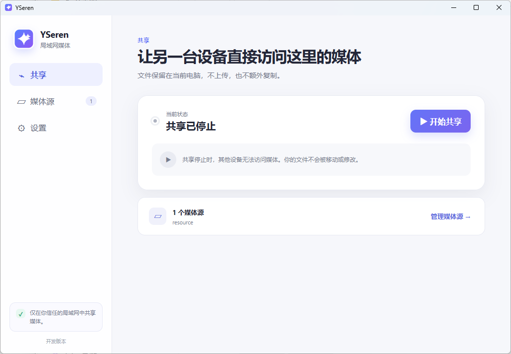
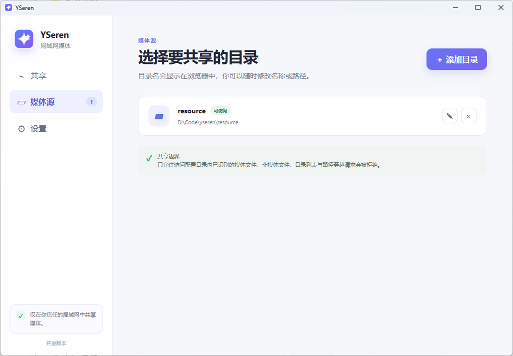
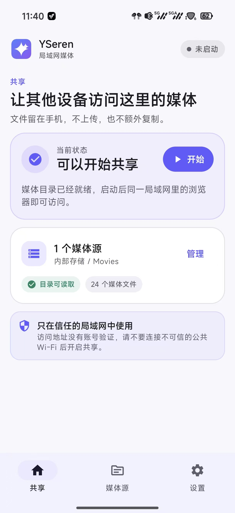
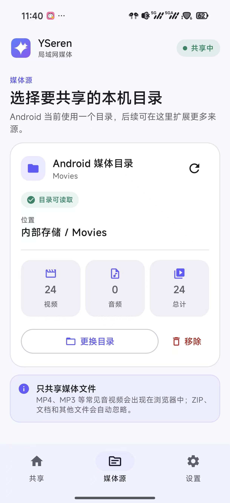
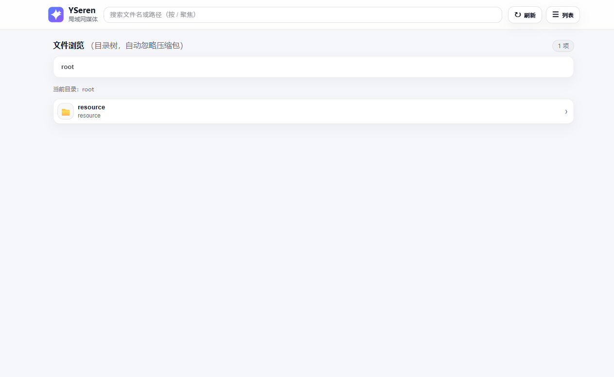

# YSeren ✦

[](https://github.com/Seacolour/YSeren/releases/latest)
[](https://github.com/Seacolour/YSeren/actions/workflows/ci.yml)

一个轻量的局域网媒体访问工具：媒体文件保留在原设备、原目录中，不上传，也不额外复制；另一台设备只需打开浏览器即可浏览和播放。

YSeren 同时提供面向普通用户的 Windows Desktop、把手机作为媒体源的 Android 应用，以及适合脚本化和服务器环境的 Headless 单文件版本。三者共享同一套 Web Player 与 HTTP 契约。

> YSeren 没有账号或访问密码。只应在你信任的局域网中开启共享，不要直接暴露到公网。

## 界面预览

### Windows Desktop

<p align="center">
  
  
</p>

### Android 媒体源

<p align="center">
  
  
</p>

### 浏览器 Web Player

<p align="center">
  
</p>

## 我该下载哪一个？

前往 [GitHub Releases](https://github.com/Seacolour/YSeren/releases/latest)，按使用场景选择：

| 使用场景 | 下载文件 |
| --- | --- |
| 普通 Windows 10/11 x64 用户 | `YSeren-vX.Y.Z-Desktop-Windows-x64-Setup.exe` |
| Windows 用户，不希望安装 | `YSeren-vX.Y.Z-Desktop-Windows-x64-Portable.zip` |
| Windows 自动化、旧版 YAML 用户 | `YSeren-vX.Y.Z-Headless-Windows-x64.zip` |
| Linux x64 服务器、NAS、WSL | `YSeren-vX.Y.Z-Headless-Linux-x64.tar.gz` |
| Linux arm64 设备 | `YSeren-vX.Y.Z-Headless-Linux-arm64.tar.gz` |
| 把 Android 手机或平板作为媒体源 | `YSeren-vX.Y.Z-Android.apk` |

Linux Desktop GUI 尚未提供。Linux arm64 当前只有静态交叉构建验证，没有真实 arm64 设备运行证据。

Windows 安装包暂未购买代码签名证书，因此 SmartScreen 可能显示“未知发布者”。请只从本仓库 Release 下载，并用随附的 `SHA256SUMS.txt` 核对文件。

## 一分钟开始共享

### Windows Desktop

1. 运行 Setup 安装包，或解压 Portable ZIP 后运行 `YSeren.exe`。
2. 点击“添加目录”，选择本机媒体文件夹。
3. 共享启动后，点击局域网地址或“在浏览器中打开”。

Desktop 会把媒体服务运行在同一进程内，不会再启动一个外部 `yseren.exe`。安装模式把配置保存在 `%APPDATA%\YSeren`；Portable 包把配置保存在 EXE 同目录。

### Android

1. 安装 APK，打开 YSeren 并授权一个媒体目录。
2. 点击“开始”。保持前台共享通知运行。
3. 在同一局域网的另一台设备中打开应用显示的局域网地址。

Android 应用是“媒体源”，不是自建播放器；浏览和播放仍由另一台设备的浏览器承担。

### Windows Headless

```powershell
Copy-Item .\yseren.example.yaml .\yseren.yaml
# 编辑 yseren.yaml，将 sources[].path 改成实际媒体目录
.\yseren.exe -config .\yseren.yaml
```

### Linux Headless

```bash
tar -xzf YSeren-vX.Y.Z-Headless-Linux-x64.tar.gz
cd YSeren-vX.Y.Z-Headless-Linux-x64
cp yseren.example.yaml yseren.yaml
# 编辑 yseren.yaml，将 sources[].path 改成实际媒体目录
./yseren -config ./yseren.yaml
```

启动后访问终端输出的 `http://localhost:1479/` 或局域网地址。

## YAML 配置

Headless 默认依次查找当前目录和程序同目录的 `yseren.yaml` / `yseren.yml`，也可以用 `-config` 指定。旧版本 YAML 可继续直接使用，Desktop 也支持导入和导出 YAML。

```yaml
server:
  port: 1479
  log_level: info  # debug, info, warn, error

sources:
  - name: videos
    path: "D:/Videos"  # Linux 示例：/home/your-name/Videos

# 可选：自定义完整媒体扫描名单
# media_extensions:
#   - .mp4
#   - .mp3

# 可选：补充应使用音频播放器的扩展名
# audio_extensions:
#   - .opus
#   - .mka
```

自定义音频格式时优先写 `audio_extensions`，避免被前端误判成视频。YSeren 只识别媒体文件，不显示或处理 ZIP、文档等其他文件。

## 能力与边界

- `/stream/{source}/{relativePath}`：安全限制在已配置媒体源内，支持 GET、HEAD 与单段 HTTP Range。
- `/api/tree`：Web Player 使用的递归媒体目录；`/api/videos` 继续保留兼容。
- `/api/status`、`/api/version`：不暴露本地目录的运行状态与版本信息。
- `/playlist.m3u`：生成可供第三方播放器导入的播放列表。
- 默认识别常见 MP4、MKV、WebM、MOV、AVI、MP3、FLAC、WAV、AAC、OGG 等格式。
- Svelte Web Player 支持移动端文件浏览、搜索与最近播放。

YSeren 不做媒体刮削、账号体系、转码、云同步、内置公网穿透或内置播放器。浏览器能否播放某个文件仍取决于浏览器支持的封装和编码。

## 首次运行与局域网排障

- Windows Defender Firewall 首次询问时，只建议允许“专用网络”，不要为公共网络放行。
- 两台设备必须处于能够互相访问的同一局域网；访客 Wi-Fi、AP 隔离和模拟器 NAT 常会阻断访问。
- 默认端口是 TCP `1479`。端口冲突时可在 Desktop/Android 设置页或 YAML 中更换。
- Linux 使用 UFW 时，可按需执行 `sudo ufw allow 1479/tcp`；只应在可信网络中开放。
- Android 若被系统停止后台服务，请允许前台通知，并检查电池优化或后台运行限制。
- 如果页面能打开但媒体不能播放，通常是浏览器不支持该文件编码；YSeren 不会自动转码。

## 校验下载文件

Windows PowerShell：

```powershell
Get-FileHash .\YSeren-v0.2.0-Desktop-Windows-x64-Setup.exe -Algorithm SHA256
Select-String -Path .\SHA256SUMS.txt -Pattern 'Desktop-Windows-x64-Setup'
```

Linux：

```bash
sha256sum YSeren-v0.2.0-Headless-Linux-x64.tar.gz
grep 'Headless-Linux-x64' SHA256SUMS.txt
```

两边显示的 SHA256 必须完全一致。

## 开发与构建

```powershell
# Headless：构建共享 Web Player 并输出 yseren.exe
.\build.ps1

# 非 tag 的本地构建显示 dev；可显式验证版本注入
.\build.ps1 -Version 0.2.0 -Out .\tmp\yseren-version-test.exe

# Windows Desktop
Set-Location .\desktop
wails build -nsis -clean

# Android（请使用 JDK 17）
Set-Location .\android
.\gradlew.bat :app:testDebugUnitTest :app:assembleDebug --no-daemon
```

完整验证：

```powershell
go test ./... -count=1
go vet ./...
npm --prefix frontend run build

Set-Location desktop
go test ./... -count=1
go vet ./...
npm --prefix frontend run build
```

Linux Headless 的 HTTP、Range、权限和信号冒烟：

```bash
bash scripts/linux-headless-smoke.sh ./yseren
```

Docker Headless 当前处于本地可行性验证阶段，可通过 Docker Desktop 构建
现有 Go Core 的非 root、只读媒体挂载镜像。使用方式和已知容器网络边界见
[Docker Headless 说明](./docker/README.md)。目前尚未发布官方镜像。

正式 Release 由精确 `vMAJOR.MINOR.PATCH` tag 统一注入 Headless、Desktop 和 Android 版本，构建全部支持平台产物，生成 `SHA256SUMS.txt`，并先创建 Draft Release 供人工复核。

## 项目文档

- [Windows Desktop 使用与构建](./desktop/README.md)
- [Android 使用与构建](./android/README.md)
- [Docker Headless 本地构建与验证](./docker/README.md)
- [多平台应用化重构计划](./docs/multiplatform-app-refactor-plan.md)
- [Phase 5 发布准备与验证矩阵](./docs/phase-5-release-preparation.md)
- [共享 HTTP 契约](./contracts/README.md)
- [贡献说明](./CONTRIBUTING.md)
- [变更日志](./CHANGELOG.md)
- [安全策略](./SECURITY.md)

## License

Apache-2.0. See [LICENSE](./LICENSE).
